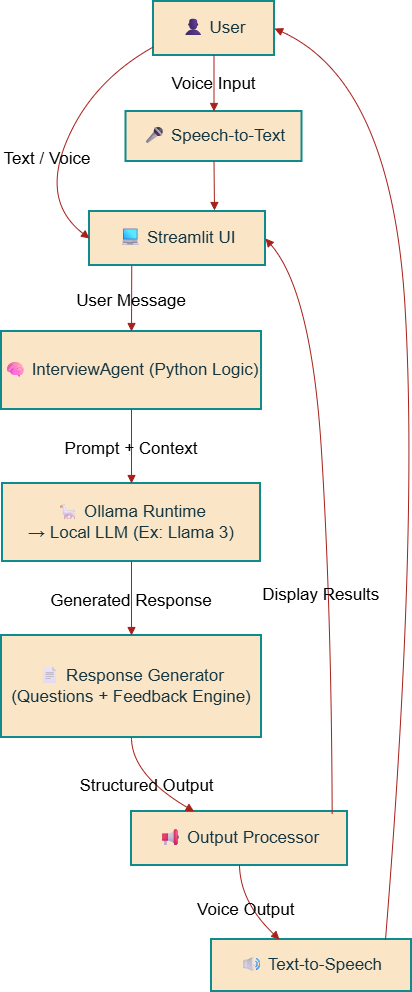

# AI Interview Practice Partner 

This project is an AI-powered mock interview assistant designed to help users practice interview questions in a natural way. The bot adjusts its responses based on the role you enter (for example: Software Engineer, Data Analyst, Sales Associate, etc.) and your answers. It can work through text input or voice input, and at the end, it gives feedback similar to a real interviewer.

Everything runs locally using **Ollama**, which means:

- No paid API keys
- No internet needed once installed
- No privacy risks since data stays on the device

## What this Can Do

- Starts the interview based on the job role
- Asks contextual follow-up questions
- Allows the candidate to answer using voice or text
- Understands different communication styles
- Gives end-of-interview feedback with:
  - Strengths & weaknesses  
  - Communication score  
  - Confidence score  
  - Knowledge score  
  - Final recommendation (Hire / Maybe / No)

## Why I Built It This Way

I wanted to focus more on **conversation quality and adaptability**, rather than just fixed question lists. Also:

- Using Ollama keeps the project free and offline
- Streamlit made it easy to build a clean UI
- Adding voice support made it feel more natural and interactive

I tried to design it in a way that feels like a real interview where answers matter, instead of a chatbot reading a script.

## Architecture

High-level flow:

# Setup Guide

## Requirements

Before starting, make sure you have:
- Python 3.10 or higher

## Step 1 — Download Python

Check if Python is installed:
    python --version

## Step 2 — Clone the Project

git clone https://github.com/ravi-RS-858/Interview-Practice-Partner.git

## Step 3 — Install Dependencies

pip install -r requirements.txt

## Step 4 — Install Ollama

Download from:
[Ollama](https://ollama.com/download)

Once installed, download the model:
    ollama pull llama3

## Step 5 — Start Ollama

Make sure Ollama is running in the background:
    ollama serve

## Step 6 — Run the Application

streamlit run app.py
